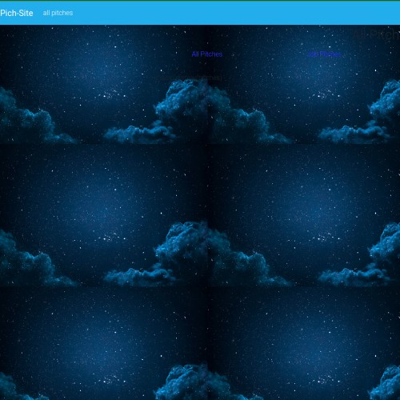

# pitch-site
## Author

[David Njagi](https://github.com/poldiee)

# Description
a flask application that allows users to post one minute pitches and also allows other users who have signed up to comment on pitch. It also allows a person to signup to be able to access the functionalities of the appl

## Live Demo

## Screenshot



## User Story

* Comment on pitch posted py other uses.
* See the pitches posted by other uses.
* Vote on pitch they have viwed
* Register to log in to the application
* View different categories pitches.
* Submit a pitch depending on specific category.


## Development Installation
To get the code..

1. Cloning the repository:
  ```bash
  https://github.com/poldiee/pitch-site.git
  ```
2. Move to the folder and install requirements
  ```bash
  cd pitch-site
  pip install -r requirements.txt
  ```
3. Exporting Configurations
  ```bash
  export SQLALCHEMY_DATABASE_URI=postgresql+psycopg2://{User Name}:{password}@localhost/{database name}
  ```
4. Running the application
  ```bash
  python3.8 manage.py server
  ```
5. Testing the application
  ```bash
  python3.8 manage.py test
  ```
Open the application on your browser `127.0.0.1:5000`.


## Technology used

* [Python3.8](https://www.python.org/)
* [Flask](http://flask.pocoo.org/)
* 


## Known Bugs
* 

## Contact Information 
any question or contributions, please email @[nessidave@gmail.com]

## License
* *MIT License:*
* Copyright (c) 2022 **poldiee**